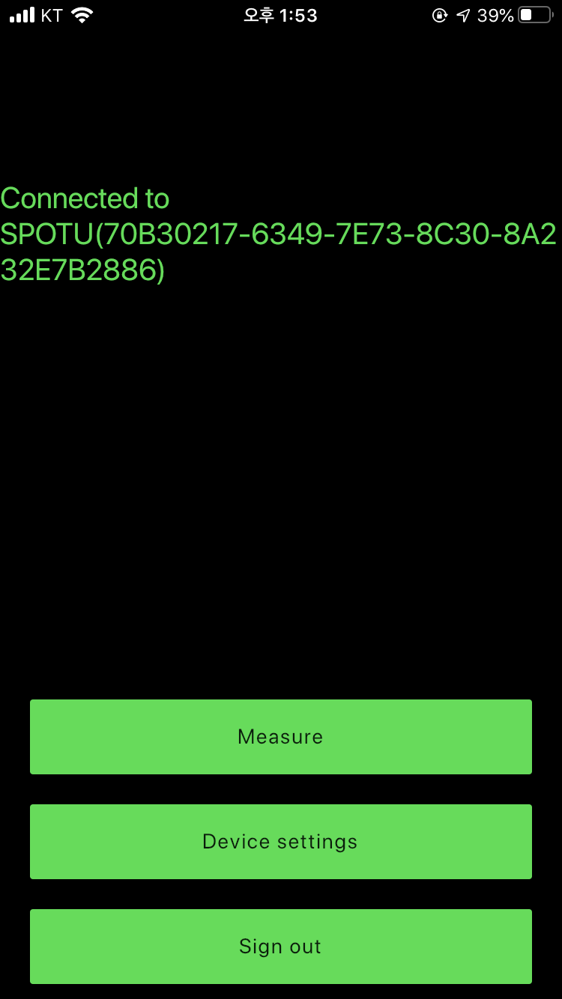
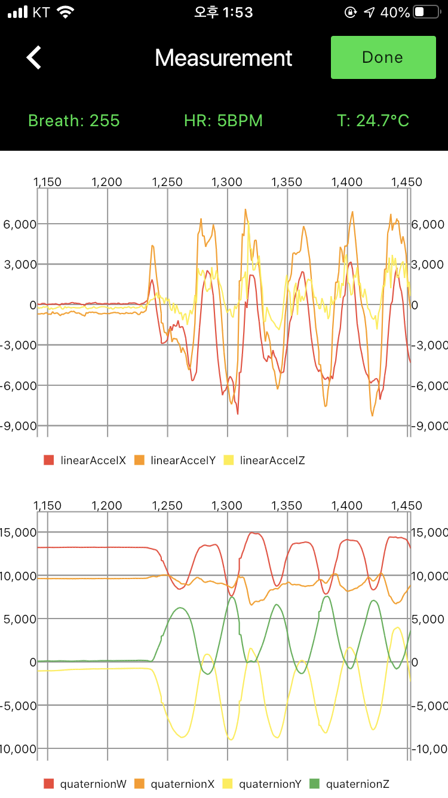
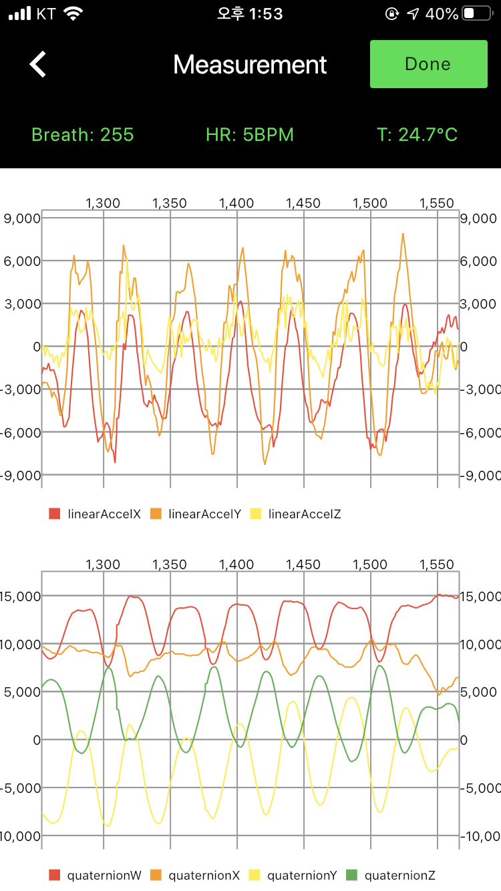

## Jerry for SPOTU
Jerry는 ios/android에서 SPOTU 장비를 이용하여 생체데이터를 측정할 수 있는 애플리케이션입니다.

## v1.0
- BLE(Bluetooth Low Energy)를 사용하여 SPOTU장비와 연결합니다.
- 측정값을 서버로 전송합니다.

### Screenshots

## 사용자지원
사용의 문제가 있거나 문의할 사항은 [admin@spotu.io](mailto://admin@spotu.io)로 보내주세요 :)

all rights reserved to spotu

[https://www.spotu.io/](https://www.spotu.io/)
